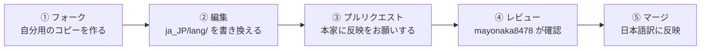

<div align="center">

# Better than Adventure! 日本語化ランゲージパック

#### BTA Japanese Language Pack

Minecraft Beta 1.7.3 の大規模フォーク「Better than Adventure!」を、有志の手で日本語に翻訳するプロジェクトです。

<br>

<a href="https://www.youtube.com/watch?v=cOWYcxlanGY"></a>

<b>BTA! 8.0 リリーストレーラー</b><br>
<sub>8.0 Release Trailer</sub>

<br>
<br>


<br>

<!-- 公式リンク / Official links -->
<sub>■ &nbsp; 公式 / Official &nbsp; ■</sub>

<table align="center">
<tr>
<td align="center" valign="top" width="120">
<a href="https://www.betterthanadventure.net/"></a><br>
<b>公式サイト</b><br><sub>Website</sub>
</td>
<td align="center" valign="top" width="120">
<a href="https://www.betterthanadventure.net/downloads/"></a><br>
<b>ダウンロード</b><br><sub>Download</sub>
</td>
<td align="center" valign="top" width="120">
<a href="https://www.betterthanadventure.net/installation-guide/"></a><br>
<b>導入ガイド</b><br><sub>Install Guide</sub>
</td>
<td align="center" valign="top" width="120">
<a href="https://bta.miraheze.org"></a><br>
<b>Wiki</b><br><sub>Wiki</sub>
</td>
<td align="center" valign="top" width="120">
<a href="https://youtube.com/@BetterthanAdventure"></a><br>
<b>YouTube</b><br><sub>Official</sub>
</td>
<td align="center" valign="top" width="120">
<a href="https://www.betterthanadventure.net/discord"></a><br>
<b>Discord</b><br><sub>Official</sub>
</td>
</tr>
</table>

<br>

<sub>■ &nbsp; 日本コミュニティ / Japanese Community &nbsp; ■</sub>

<table align="center">
<tr>
<td align="center" valign="top" width="150">
<a href="https://www.youtube.com/@betterthanadventurejp"></a><br>
<b>YouTube</b><br><sub>日本コミュニティ</sub>
</td>
<td align="center" valign="top" width="150">
<a href="https://discord.gg/fVrhyRwXgw"></a><br>
<b>Discord</b><br><sub>日本コミュニティ</sub>
</td>
</tr>
</table>

<br>
<br>

[BTAについて](#better-than-adventure-について) &nbsp;•&nbsp;
[導入方法](#導入方法--installation) &nbsp;•&nbsp;
[本プロジェクト](#本プロジェクトについて) &nbsp;•&nbsp;
[ファイル構成](#リポジトリの構成--repository-structure) &nbsp;•&nbsp;
[翻訳状況](#現在の翻訳状況--current-status) &nbsp;•&nbsp;
[翻訳の手引き](#翻訳の手引き--translation-guide) &nbsp;•&nbsp;
[用語集](#用語集--glossary) &nbsp;•&nbsp;
[参加方法](#翻訳に参加する--how-to-contribute) &nbsp;•&nbsp;
[English](#about-better-than-adventure)

</div>

---

## Better than Adventure! について

Better than Adventure!（以下 BTA）は、2011年に公開された Minecraft Beta 1.7.3 を土台とする、非公式の大規模フォークプロジェクトです。開発は Mak 氏と jonkadelic 氏を中心に、コミュニティからの意見や不具合報告を取り入れながら進められています。

現在の Minecraft は、公開から十数年を経て大きく姿を変えました。数多くの新要素が加わった一方で、その方向性に馴染めない方や、アドベンチャーアップデート以前の素朴なゲーム性に愛着を持つ方も少なくありません。BTA は、そうしたプレイヤーに向けて「もし当時の Minecraft が、少し違う方向に進化していたら」という、もうひとつの可能性を形にしようとする試みです。

開発の指針となっているのは、「この要素は、2011年当時の Mojang であれば追加していただろうか」という問いです。空腹・経験値・エンチャントといった後年の仕組みに頼ることなく、Beta 1.7.3 の雰囲気を保ったまま、新しい遊びや数多くの改善・最適化が加えられています。

BTA は、あの頃の Minecraft を懐かしむ方にも、古いバージョンに新鮮な体験を求める方にも楽しんでいただけることを目指した、いわば「もし在り得たかもしれない Minecraft」です。

---

## 導入方法 / Installation

BTA は Minecraft のコードを大きく書き換えているため、通常の Mod のような導入方法では動作しません。**MultiMC** または **Prism Launcher** を使った導入が公式に推奨されています。

<sub>BTA rewrites large parts of the game, so the usual mod-installation routine won't get you anywhere. The team recommends running it through MultiMC or Prism Launcher.</sub>

1. **Java 17 以上**を用意する（v8.0 以降で必須）
2. [Prism Launcher](https://prismlauncher.org/) または MultiMC を導入する
3. [公式ダウンロードページ](https://www.betterthanadventure.net/downloads/)から **BTA! Updater** を入手する
4. ダウンロードした ZIP をランチャーにドラッグ＆ドロップしてインポートする
5. アップデーターを起動して「Install」を選ぶと、`Better than Adventure!` インスタンスが作成されます

> 一度この方法で導入しておくと、以降は同じアップデーターから最新版へ更新でき、**ワールド・設定・統計はそのまま引き継がれます**。
> 詳しい手順は[公式の導入ガイド](https://www.betterthanadventure.net/installation-guide/)をご覧ください。

<details>
<summary><b>Installing BTA! (English)</b></summary>

<br>

1. Make sure you have **Java 17 or newer**. Anything older won't start v8.0 or above.
2. Install [Prism Launcher](https://prismlauncher.org/) (or MultiMC).
3. Grab the **BTA! Updater** from the [official downloads page](https://www.betterthanadventure.net/downloads/).
4. Drag the downloaded ZIP into your launcher to import it.
5. Run the updater, click *Install*, and a `Better than Adventure!` instance will appear in your launcher.

Set it up once and every release after that is a single click away in the same updater, and your worlds, settings and statistics all carry over untouched. The [official installation guide](https://www.betterthanadventure.net/installation-guide/) covers the alternative routes in more depth.

</details>

### 日本語化の適用 / Applying this language pack

BTA のランゲージパックは、リソースパックとは置き場所が異なります。**ZIP のまま `languages` フォルダに入れる**のがポイントです。

1. `ja_JP` フォルダを **ZIP に圧縮**する（`lang/` と `lang_info.json` が ZIP 直下に来るようにします）
2. ゲームを起動し、**設定 → ランゲージパック → フォルダを開く** を選ぶ
3. 開いたフォルダ（`languages`）に、**ZIP を解凍せずそのまま**入れる
4. ゲームの設定から、表示された「日本語」を選択する

<details>
<summary><b>Applying the pack (English)</b></summary>

<br>

Language packs don't sit alongside resource packs in BTA. They have a folder of their own, and they stay zipped.

1. Compress the `ja_JP` folder into a **ZIP**, with `lang/` and `lang_info.json` at the top level of the archive.
2. Launch the game and head to **Options → Language Packs → Open Folder**.
3. Drop the ZIP straight into the `languages` folder that opens, and leave it zipped.
4. Pick 日本語 from the language list in the settings.

</details>

---

## 本プロジェクトについて

本リポジトリは、BTA を日本語で楽しむための日本語化ランゲージパックを、有志の手で整備していくためのものです。

私はこれまで、BTA の日本語翻訳を個人で続けてまいりました。しかし、7.3 アップデートによって追加された翻訳項目が予想をはるかに超えて増えたこと、そして私自身が翻訳以外にも BTA で取り組みたいことが増えてきたことから、今後も一人で翻訳を続けていくことは難しいと判断いたしました。

そこで、この GitHub リポジトリを立ち上げ、GitHub アカウントをお持ちの方であれば、どなたでもプルリクエストという形で翻訳に参加していただけるようにいたしました。BTA の翻訳にご協力いただける方は、翻訳ファイルのプルリクエストを本リポジトリへお送りいただけますと幸いです。

なお、いただいたプルリクエストを反映するかどうかは私が確認のうえ判断いたしますので、お送りいただく前に私へご連絡いただく必要はございません。

<div align="right"><sub>— mayonaka8478</sub></div>

---

## About Better than Adventure!

Better than Adventure! (BTA) is a large-scale, unofficial fork of Minecraft Beta 1.7.3 — the version that shipped back in 2011. It's led by Mak and jonkadelic, and keeps evolving thanks to feedback and bug reports from its community.

Minecraft has come a long way since then. Plenty of players love where it's headed, but others still feel most at home in the simpler days of the beta era, before the Adventure Update. BTA is built for them: an alternate-universe take on Minecraft that imagines where the game might have gone had it grown in a slightly different direction.

Every addition follows one simple rule of thumb — *"Would Mojang have added this back in 2011?"* Instead of leaning on later systems like hunger, experience, or enchanting, BTA keeps the look and feel of Beta 1.7.3 intact while layering in fresh gameplay, along with countless refinements and performance improvements.

Whether you're here for that classic Minecraft nostalgia or just want a fresh take on the old-school game, there's something in BTA for you.

## About This Project

This repository is home to the community Japanese language pack for BTA.

Up to now, I'd been handling the Japanese translation entirely on my own. But the 7.3 update brought in far more text than I'd ever expected, and I've increasingly found myself wanting to work on other parts of BTA besides translation. Keeping up with all of it alone simply wasn't realistic anymore.

So I set up this GitHub repository to open the translation up to everyone. Anyone with a GitHub account can now pitch in through pull requests. If you'd like to help translate BTA, I'd be truly grateful if you'd submit your translation files as a pull request here.

One note: I review every pull request myself and decide what gets merged, so there's no need to get in touch before you send one.

<div align="right"><sub>— mayonaka8478</sub></div>

---

## リポジトリの構成 / Repository Structure

本プロジェクトのファイル構成と、それぞれの翻訳ファイルが担当する内容は次のとおりです。翻訳は、`en_US/` の原文を参照しながら、`ja_JP/lang/` 内の同名ファイルを編集して進めます。

<sub>Here's how the repository is laid out. To translate, edit the matching file in `ja_JP/lang/`, keeping the English source in `en_US/` open beside you.</sub>

```text
bta_ja_JP/
├─ en_US/              英語の原文ファイル（翻訳のお手本 / source）
├─ ja_JP/              日本語ランゲージパック本体
│  ├─ lang/            翻訳ファイル群（ここを編集 / edit here）
│  └─ lang_info.json   言語パックの情報（名前・クレジット）
├─ en_US_1.2.5.lang    ┐
├─ en_US_1_1.lang      │  旧バージョンの参考資料
├─ ja_JP_1.2.5.lang    │  Older reference files
├─ ja_JP_1_1.lang      │
└─ ja_jp_opti.lang     ┘
```

### 翻訳ファイル / Translation Files

翻訳の対象となるファイルの一覧です（規模の大きい順）。行数は `en_US/` の原文を基準にしています。

<sub>The files you'll be working on, largest first. Line counts are taken from the English sources in `en_US/`.</sub>

| ファイル / File | 内容 / Content | 規模 / Lines |
|:--|:--|--:|
| `tile.lang` | ブロックの名前と説明<br><sub>Block names & descriptions</sub> | ~1,600 |
| `item.lang` | アイテムの名前と説明<br><sub>Item names & descriptions</sub> | ~580 |
| `gui.lang` | メニュー・ボタンなど画面上のテキスト<br><sub>Menus, buttons & on-screen text</sub> | ~480 |
| `options.lang` | 設定画面の項目<br><sub>Settings / options screen</sub> | ~440 |
| `command.lang` | コマンドの説明とエラーメッセージ<br><sub>Command help & error messages</sub> | ~210 |
| `strings.lang` | ディメンション名・季節名などの各種テキスト<br><sub>Dimensions, seasons & misc. text</sub> | ~180 |
| `stats.lang` | 統計画面の項目（プレイ回数など）<br><sub>Statistics screen entries</sub> | ~160 |
| `subtitles.lang` | 効果音の字幕<br><sub>Sound-effect subtitles</sub> | ~120 |
| `messages.lang` | サーバー・システムのメッセージ<br><sub>Server & system messages</sub> | ~60 |
| `guidebook.lang` | ゲーム内ガイドブックの見出し<br><sub>In-game Guidebook headings</sub> | ~60 |
| `biomes.lang` | バイオーム（地形）の名前<br><sub>Biome names</sub> | ~40 |
| `gamerules.lang` | ゲームルールの名前と説明<br><sub>Game rule names & descriptions</sub> | ~40 |
| `tips.txt` | ロード中に表示されるヒント・豆知識<br><sub>Loading-screen tips</sub> | ~30 |
| `worldsettings.lang` | ワールド生成設定の項目<br><sub>World-generation settings</sub> | ~10 |
| `info.lang` / `lang_info.json` | 言語自体の情報（言語名・クレジット）<br><sub>Language metadata (name, credits)</sub> | 数行 |

> **補足 / Note**
> `keyboard.json`（言語ごとのキーボード配列）と `worldnames.txt`（ワールド名のランダム生成リスト）は、通常は翻訳の必要がありません。
> <br><sub>`keyboard.json` (per-language keyboard layout) and `worldnames.txt` (the random world-name list) don't normally need translating.</sub>

<details>
<summary><b>旧バージョンの参考資料 / Legacy reference files（クリックで展開）</b></summary>

<br>

翻訳作業時に、語彙や言い回しをそろえるための参考資料です。
<sub>Handy references for keeping wording and terminology consistent.</sub>

| ファイル / File | 内容 / Content |
|:--|:--|
| `en_US_1.2.5.lang` | Minecraft 1.2.5 相当の旧・英語ファイル<br><sub>Legacy English (MC 1.2.5)</sub> |
| `en_US_1_1.lang` | Minecraft 1.1 相当の旧・英語ファイル<br><sub>Legacy English (MC 1.1)</sub> |
| `ja_JP_1.2.5.lang` | 1.2.5 相当の旧・日本語ファイル<br><sub>Legacy Japanese (MC 1.2.5)</sub> |
| `ja_JP_1_1.lang` | 1.1 相当の旧・日本語ファイル<br><sub>Legacy Japanese (MC 1.1)</sub> |
| `ja_jp_opti.lang` | OptiFine 系の旧・日本語翻訳（過去の貢献者による）<br><sub>Legacy OptiFine-style Japanese translation</sub> |

</details>

---

## 現在の翻訳状況 / Current status

`en_US` は更新が進んでいますが、`ja_JP` 側はまだ追いついていない箇所があります。**これから参加される方は、この表の項目が狙い目です。**

<sub>The English sources have moved ahead, and the Japanese side hasn't caught up everywhere. If you're looking for somewhere to start, start here.</sub>

| 対象 / File | 状況 / Status |
|:--|:--|
| `messages.lang` | `en_US` にはありますが、`ja_JP/lang/` にまだファイルがありません<br><sub>Present in `en_US`, but no counterpart in `ja_JP/lang/` yet</sub> |
| `worldsettings.lang` | 同上<br><sub>Likewise</sub> |
| `strings.lang` | `en_US` にあって `ja_JP` にないキーが残っています（ディメンション名・`direction.*`・`side.*`・`container.*` など）<br><sub>A number of keys in `en_US` are still missing here, including dimension names, `direction.*`, `side.*` and `container.*`</sub> |
| その他 / Others | 英語のまま残っている行が、ファイルによって点在しています<br><sub>Untranslated lines are scattered here and there, file by file</sub> |

> ここに書かれた状況は、確認した時点のものです。**作業を始める前に、必ず最新の `en_US` と `ja_JP` を見比べてください。**
> <br><sub>This is a snapshot rather than a live figure. Always compare the current `en_US` against `ja_JP` before you begin.</sub>

---

## 翻訳の手引き / Translation Guide

翻訳ファイルは、1行につき1項目の、シンプルな `キー=値` 形式です。**イコールの左側（キー）は絶対に変更しないでください。** 変更すると、ゲーム側がテキストを見つけられなくなります。

<sub>Every line is a plain `key=value` pair. Whatever sits to the left of the equals sign is the key, and it has to stay exactly as you found it. The game looks text up by that key, so a renamed key is a line it can no longer find.</sub>

```properties
tile.marble.name=大理石
                 ↑ ここだけを日本語にします / translate only this part
```

### 守っていただきたいこと / Ground rules

**お願いしたいこと**

- 文字コードは UTF-8（BOM なし）で保存してください
- 改行コードは元のファイルのままにしてください
- `#` で始まる行はコメントです。そのまま残してください
- 空行の位置も、なるべく元のまま保ってください

**避けていただきたいこと**

- イコールの左側（キー）の変更・並び替え・削除
- 既存の訳を、好みだけで大きく書き換えること

<sub>Please save as UTF-8 without a BOM, leave the line endings as you found them, and keep the comment lines and blank lines where they are. Please don't rename, reorder or delete keys, and don't rewrite a settled translation purely on personal taste.</sub>

### 特殊な記号の扱い / Special markers

翻訳文の中には、ゲームが自動的に置き換える記号が含まれていることがあります。これらは**必ずそのまま残してください。**

<sub>Some lines contain markers the game fills in at runtime. Carry every one of them across untouched.</sub>

| 記号 / Marker | 意味 / Meaning | 注意点 / Watch out |
|:--|:--|:--|
| `%s` | プレイヤー名などが入る差し込み位置<br><sub>A slot for a player name or similar</sub> | **英語と同じ順番で並べてください。** 日本語の語順に合わせて入れ替えると、表示される内容が入れ替わってしまいます<br><sub>Keep the placeholders in the same order as the English. Shuffling them to suit Japanese word order swaps the values around</sub> |
| `%d` | 数値が入る差し込み位置<br><sub>A slot for a number</sub> | 同上<br><sub>Same rule</sub> |
| `§a` `§e` `§r` など | 文字色・装飾の指定<br><sub>Colour and formatting codes</sub> | 記号と直後の1文字がセットです。消さないでください<br><sub>The symbol and the character right after it are a pair. Never split or drop them</sub> |
| `\n` | 改行<br><sub>A line break</sub> | 説明文でよく使われます<br><sub>Common in description text</sub> |

<details>
<summary><b>%s の順番についての具体例 / Why placeholder order matters（クリックで展開）</b></summary>

<br>

`%s` は「1つ目・2つ目…」と**順番で中身が決まります**。日本語として自然にしようと入れ替えると、名前と場所が逆になるような不具合が起きます。

<sub>Placeholders are filled in by position, not by meaning. Reorder them and the game will happily put the wrong name in the wrong slot.</sub>

```properties
# 英語の原文（1つ目=プレイヤー名, 2つ目=対象）
messages.example=%s gave a diamond to %s

# 良い例：順番を保っている
messages.example=%s がダイヤモンドを %s に渡した

# 悪い例：順番を入れ替えると、誰が誰に渡したのか逆になる
messages.example=%s に %s がダイヤモンドを渡した
```

</details>

### 訳しかたの方針 / Style

- **基本は「です・ます」調**の、ていねいな文体で統一しています
- 通常の Minecraft（Java版）にも登場する語は、**公式日本語版の訳語に合わせます**
- アイテムやブロックの説明文（`.desc`）には、遊び心のある言い回しも歓迎です
- **既存の訳は、原則としてそのまま尊重してください。** 明らかな誤りや、英語原文の変更によって意味がずれてしまった箇所を見つけた場合は、プルリクエストの説明欄に理由を書き添えていただけると助かります

<details>
<summary><b>House style (English)</b></summary>

<br>

- We write in polite Japanese (です・ます調) throughout.
- Anything that also exists in vanilla Minecraft follows the official Japanese wording.
- Item and block descriptions (`.desc`) are where a little wit is welcome. The English originals are full of it.
- Treat existing translations as settled. If you spot an outright mistake, or a line that drifted out of sync when the English changed, do fix it, but please spell out your reasoning in the pull request.

</details>

---

## 用語集 / Glossary

翻訳の表記をそろえるための、確定済みの訳語です。迷ったときはこちらを参照してください。

<sub>Settled terminology, so wording stays consistent from one file to the next. When in doubt, look here first.</sub>

<details open>
<summary><b>ディメンション・季節・天候 / Dimensions, seasons & weather</b></summary>

<br>

| English | 日本語 | 補足 / Notes |
|:--|:--|:--|
| the Overworld | オーバーワールド | |
| the Nether | ネザー | |
| the Drift | ドリフト | ディメンション名 / a dimension |
| Paradise | パラダイス | **ドリフトとは別物**。オーバーワールドのワールドタイプの名前です<br><sub>Not the Drift. This is an Overworld world type</sub> |
| Spring / Summer / Fall / Winter | 春 / 夏 / 秋 / 冬 | |
| Endless Winter | 永遠の冬 | |
| Gold / Silver | ゴールド / シルバー | ドリフトの季節 / seasons of the Drift |
| Clear / Raining / Snowing / Thundering / Foggy | 晴れ / 雨 / 雪 / 雷雨 / 霧 | |

> [!WARNING]
> **キー名の変更にご注意ください。** 現在の `en_US` では `dimension.nether.name` / `dimension.drift.name` が使われていますが、`ja_JP` 側には古い `dimension.hell.name` / `dimension.paradise.name` が残っています。翻訳の際は、**必ず `en_US` 側のキーに合わせてください。**
> <br><sub>Mind the renamed keys: `en_US` now uses `dimension.nether.name` and `dimension.drift.name`, while `ja_JP` still carries the older `dimension.hell.name` and `dimension.paradise.name`. Always follow the keys in `en_US`.</sub>

</details>

<details>
<summary><b>バイオーム（オーバーワールド）/ Overworld biomes</b></summary>

<br>

| English | 日本語 |
|:--|:--|
| Rainforest | 雨林 |
| Swamp | 沼地 |
| Muddy Swamp | 泥沼 |
| Seasonal Forest | 季節林 |
| Forest | 森林 |
| Birch Forest | 白樺林 |
| Boreal Forest | 北方林 |
| Grasslands | 草地 |
| Meadow | 牧草地 |
| Shrubland | 灌木地 |
| Outback | 奥地 |
| Grassy Outback | 草深い奥地 |
| Caatinga | カーティンガ |
| Caatinga Plains | カーティンガ平原 |
| Taiga | タイガ |
| Desert | 砂漠 |
| Plains | 平原 |
| Glacier | 氷河 |
| Tundra | 凍原 |

> `legacy` が付くバイオームは「オリジナル 〇〇」と訳しています（例：`biome.overworld.legacy.taiga` → オリジナル タイガ）。
> <br><sub>Biomes under `legacy` take the prefix オリジナル (`biome.overworld.legacy.taiga` becomes オリジナル タイガ).</sub>

</details>

<details>
<summary><b>バイオーム（ネザー）/ Nether biomes</b></summary>

<br>

| English | 日本語 |
|:--|:--|
| The Crag | 岩山 |
| The Old World | 旧世界 |
| Volcanic Islands | 火山島 |
| Sulfur Pools | 硫黄湖 |
| Crystal Forest | 水晶林 |
| Crystal Plains | 水晶平原 |
| The Shelf | 岩棚 |

</details>

<details>
<summary><b>BTA 固有の素材・ブロック / BTA-specific materials</b></summary>

<br>

| English | 日本語 |
|:--|:--|
| Steel Ingot | 鋼インゴット |
| Crude Steel | 粗鋼 |
| Nether Coal | ネザーコール |
| Marble | 大理石 |
| Slate | 粘板岩 |
| Permafrost | 永久凍土 |
| Soul Sand | ソウルサンド |
| Trommel | 回転ふるい |
| Polished 〇〇 | つやあり〇〇 |
| Carved 〇〇 | 彫刻した〇〇 |
| Pillar / Capstone | 柱 / 笠石 |

</details>

<details>
<summary><b>ブロックの形状（共通ルール）/ Block shapes</b></summary>

<br>

| English | 日本語 | 例 / Example |
|:--|:--|:--|
| Slab | 半ブロック | 大理石レンガ半ブロック |
| Stairs | 階段 | 粘板岩レンガの階段 |
| Fence | フェンス | |
| Bricks | レンガ | 永久凍土レンガ |
| Cobblestone | 丸石 | 永久凍土の丸石 |

> 「〜の階段」「〜半ブロック」のように、**助詞の有無まで既存の表記に合わせてください。** 表記ゆれは、翻訳全体でいちばん目立つ不具合です。
> <br><sub>Match the existing patterns right down to the particles. Inconsistent naming is the single most visible flaw a translation can have.</sub>

</details>

---

## 翻訳に参加する / How to Contribute

GitHub アカウントさえあれば、どなたでも参加していただけます。手順は「**フォーク → 編集 → プルリクエスト**」の3ステップです。

<sub>A GitHub account is all you need. Fork it, edit it, then open a pull request. That is all there is to it.</sub>

### かんたんな流れ / At a glance



### 手順 / Steps

<details open>
<summary><b>① リポジトリをフォークする / Fork the repository</b></summary>

<br>

本リポジトリのページ右上にある **Fork** ボタンを押すと、自分のアカウントの下に同じ内容のコピー（フォーク）が作られます。以降の編集は、この自分のフォークに対しておこないます。

<sub>Hit **Fork** at the top right of this page and GitHub gives you your own copy of the repository. Everything from here on happens in that copy, not in the original.</sub>

</details>

<details open>
<summary><b>② 翻訳ファイルを編集する / Make your edits</b></summary>

<br>

自分のフォークで `ja_JP/lang/` の中の編集したいファイルを開き、鉛筆アイコン（Edit this file）から直接編集できます。編集が終わったら **Commit changes** を押して保存します。

- **ブラウザだけで完結**するので、Git の知識がなくても大丈夫です
- 大きな変更をする場合は、`translate-tile-lang` のような新しいブランチを作って作業すると管理しやすくなります

<sub>Open the file you want in `ja_JP/lang/`, click the pencil icon, and edit it right there in the browser. No Git knowledge required. Hit **Commit changes** when you're done. For anything substantial, working on a branch of its own (`translate-tile-lang`, say) will keep things tidy.</sub>

</details>

<details open>
<summary><b>③ プルリクエストを送る / Open a pull request</b></summary>

<br>

自分のフォークのページで **Contribute → Open pull request**（または **Pull requests** タブ → **New pull request**）を押します。

比較の向きが次のようになっていることを確認してください。

```text
base: mayonaka8478/bta_ja_JP : main   ←   head: あなたのアカウント/bta_ja_JP : main
（送り先 / 本家）                          （送り元 / あなたのフォーク）
```

タイトルと説明を書いて **Create pull request** を押せば完了です。説明欄には、次のような情報があると確認がスムーズになります。

- どのファイルの、どのあたりを翻訳・修正したのか
- 判断に迷った箇所や、既存の訳を変更した場合はその理由

<sub>From your fork, choose **Contribute → Open pull request**, and check the direction of the comparison before you go any further: `base` should be `mayonaka8478/bta_ja_JP : main`, `head` your own fork. Then write a title and a short description and click **Create pull request**. Mentioning which files you touched, and why you changed any existing wording, makes the review a great deal quicker.</sub>

</details>

<details>
<summary><b>補足：フォークを最新の状態に更新する（Sync fork）/ Keeping your fork current</b></summary>

<br>

本家に新しい変更が入ると、自分のフォークのページに「This branch is N commits behind mayonaka8478/bta_ja_JP:main」と表示されます。この状態のまま作業を進めると、後で内容がぶつかってしまうことがあります。

**Sync fork → Update branch** を押すと、本家の最新の内容を自分のフォークに取り込めます。**翻訳作業を始める前に、まずこれを実行するのがおすすめです。**

<sub>When the upstream repository moves on, your fork will tell you it's *N commits behind*. Carry on editing from there and you may well hit a merge conflict later. Click **Sync fork → Update branch** to pull the latest changes in, ideally before you start translating rather than after.</sub>

</details>

<details>
<summary><b>補足：送ったあとに修正したくなったら / Revising an open pull request</b></summary>

<br>

プルリクエストは、送ったあとでも修正できます。自分のフォークの同じブランチに追加でコミットすれば、その内容は自動的にプルリクエストへ反映されます。新しく作り直す必要はありません。

<sub>A pull request isn't set in stone once it's open. Push another commit to the same branch and it flows straight into the existing pull request, so there is no need to close it and start over.</sub>

</details>

> **不安な場合は、小さな範囲から送ってみてください。** 1ファイルだけ、数行だけの修正でも大歓迎です。
> いただいたプルリクエストを反映するかどうかは mayonaka8478 が確認のうえ判断しますので、事前のご連絡は不要です。
> <br><sub>If you're unsure, start small. A single file, or even a couple of lines, is very welcome. mayonaka8478 reviews everything that comes in, so there's no need to ask first.</sub>

---

## 翻訳担当者 / Translators

本プロジェクトの翻訳は、以下のメンバーが担当しています。ご連絡は各アカウントまでお気軽にどうぞ。

<sub>This translation is maintained by the members below — feel free to reach out through any of their accounts.</sub>

<div align="center">

<table>
<tr>
<td align="center" valign="top" width="290">
<a href="https://github.com/mayonaka8478"></a>
<br>
<b>mayonaka8478</b><br>
<sub>プロジェクト管理・翻訳 / Project Manager</sub>
<br><br>
<a href="https://github.com/mayonaka8478" title="GitHub"></a>
&nbsp;&nbsp;&nbsp;
<a href="https://misskey.io/@super_okura_world" title="Misskey"></a>
</td>
<td align="center" valign="top" width="290">
<a href="https://github.com/shirokuma1025"></a>
<br>
<b>abc_kuma1025</b><br>
<sub>翻訳 / Translator</sub>
<br><br>
<a href="https://github.com/shirokuma1025" title="GitHub"></a>
&nbsp;&nbsp;&nbsp;
<a href="https://misskey.io/@abc_kuma1025" title="Misskey"></a>
&nbsp;&nbsp;&nbsp;
<a href="https://twitter.com/abc_kuma1025" title="X (Twitter)"></a>
</td>
</tr>
</table>

</div>

---

<div align="center">

<sub>Better than Adventure! は Minecraft Beta 1.7.3 の非公式フォークです。<br>Minecraft は Mojang Studios の商標であり、本プロジェクトは有志による翻訳であって、Mojang Studios が公式に承認したものではありません。</sub>

<sub>Better than Adventure! is an unofficial fork of Minecraft Beta 1.7.3. <br>Minecraft is a trademark of Mojang Studios. This project is a fan-made translation and is not officially affiliated with or endorsed by Mojang Studios.</sub>

</div>
